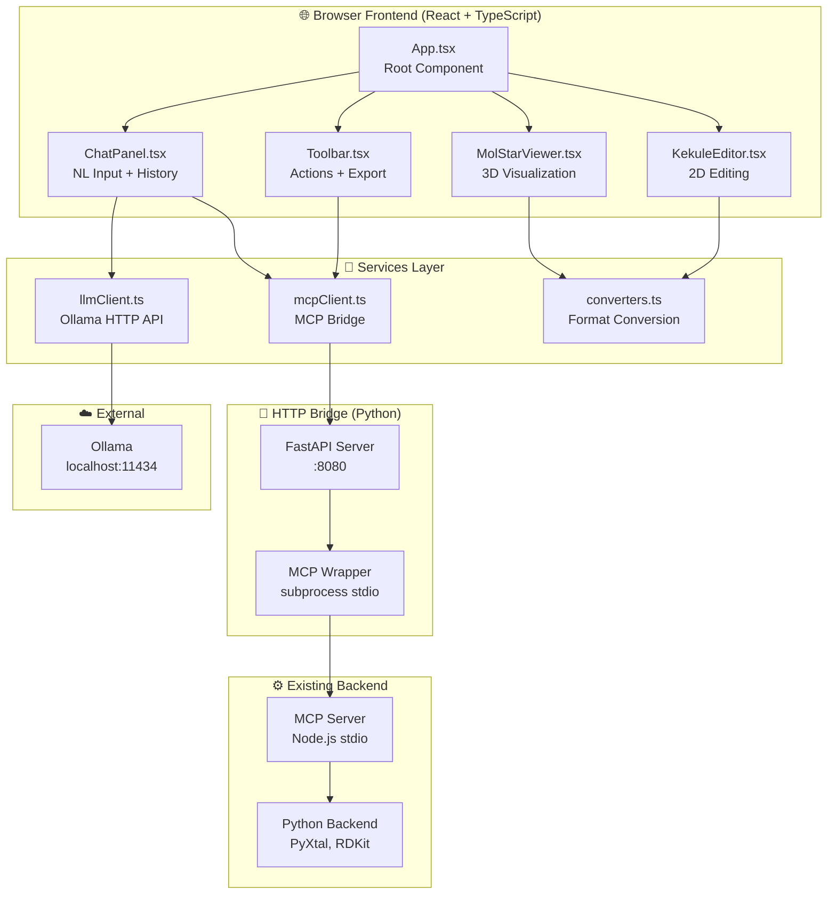

```mermaid
graph TB
    subgraph Browser["🌐 Browser Frontend (React + TypeScript)"]
        APP["App.tsx<br/>Root Component"]
        CHAT["ChatPanel.tsx<br/>NL Input + History"]
        VIEWER3D["MolStarViewer.tsx<br/>3D Visualization"]
        EDITOR2D["KekuleEditor.tsx<br/>2D Editing"]
        TOOLBAR["Toolbar.tsx<br/>Actions + Export"]
    end
    subgraph Services["📡 Services Layer"]
        LLM_SVC["llmClient.ts<br/>Ollama HTTP API"]
        MCP_SVC["mcpClient.ts<br/>MCP Bridge"]
        CONVERT["converters.ts<br/>Format Conversion"]
    end
    subgraph Bridge["🔗 HTTP Bridge (Python)"]
        REST["FastAPI Server<br/>:8080"]
        MCP_WRAP["MCP Wrapper<br/>subprocess stdio"]
    end
    subgraph Backend["⚙️ Existing Backend"]
        MCP["MCP Server<br/>Node.js stdio"]
        PYTHON["Python Backend<br/>PyXtal, RDKit"]
    end
    subgraph External["☁️ External"]
        OLLAMA["Ollama<br/>localhost:11434"]
    end
    APP --> CHAT
    APP --> VIEWER3D
    APP --> EDITOR2D
    APP --> TOOLBAR
    CHAT --> LLM_SVC
    CHAT --> MCP_SVC
    VIEWER3D --> CONVERT
    EDITOR2D --> CONVERT
    TOOLBAR --> MCP_SVC
    LLM_SVC --> OLLAMA
    MCP_SVC --> REST
    REST --> MCP_WRAP
    MCP_WRAP --> MCP
    MCP --> PYTHON
```